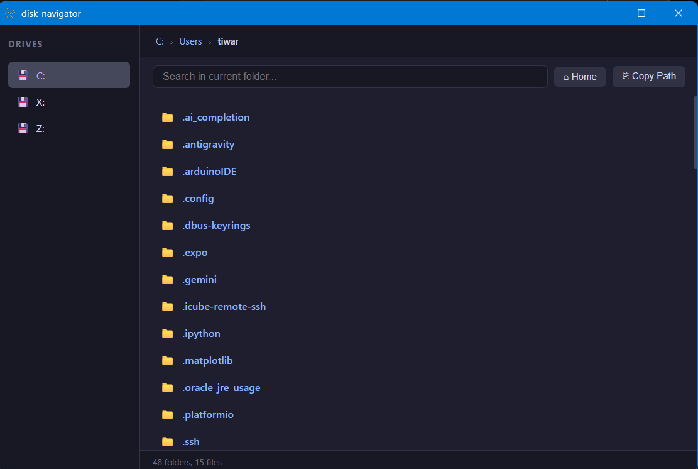
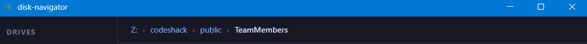
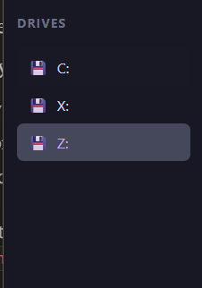

# 🗂️ Disk Navigator

A lightweight, developer-oriented desktop file explorer built with [Neutralinojs](https://neutralino.js.org/). Navigate your entire filesystem from a clean, fast, keyboard-friendly interface — without the bloat of Electron.



---

## ✨ Features

- **Global Drive Access** — instantly switch between all connected drives (C:, D:, X:, etc.)
- **Breadcrumb Navigation** — click any segment to jump back instantly
- **Live Search** — filter files in the current directory as you type
- **File Metadata** — see file/folder counts in the status bar
- **Clipboard Integration** — copy any file's absolute path with one click
- **Open with Default App** — launch files directly from the navigator
- **Permission Error Handling** — gracefully handles restricted system directories
- **Zero dependencies** — no npm packages, no frontend framework, pure JS

---

## 📸 Screenshots

### Home Directory


### Deep Navigation with Breadcrumb


### Multi-Drive Access


---

## 🏗️ Architecture

The app is structured in clean, separated layers:
```
resources/
  js/
    services/
      filesystemService.js   ← all Neutralino.filesystem calls
      osService.js           ← platform detection, drive listing, file opening
      clipboardService.js    ← all Neutralino.clipboard calls
    state/
      navigatorStore.js      ← current path, contents, search query, history
    components/
      Breadcrumb.js          ← renders navigable path segments
      FileList.js            ← renders directory contents with actions
      Sidebar.js             ← renders available drives
    main.js                  ← app entry point, event wiring
  styles/
    main.css                 ← dark theme UI
  index.html
```

**Why this structure?**
All native Neutralinojs API calls are isolated in service files. Components never call `Neutralino.*` directly — they go through services. This makes the code testable, readable, and easy to extend.

---

## 🔌 Neutralinojs Native APIs Used

| API | Usage |
|-----|-------|
| `Neutralino.filesystem.readDirectory` | List directory contents |
| `Neutralino.filesystem.getStats` | Get file size and modified date |
| `Neutralino.os.getEnv` | Detect home directory (cross-platform) |
| `Neutralino.os.open` | Open files with default system app |
| `Neutralino.clipboard.writeText` | Copy file paths to clipboard |

---

## 🚀 Getting Started

### Prerequisites
- [Node.js](https://nodejs.org/) v16+
- Neutralinojs CLI
```bash
npm install -g @neutralinojs/neu
```

### Run locally
```bash
git clone https://github.com/T-Rajeev30/disk-navigator
cd disk-navigator
neu run
```

### Build for production
```bash
neu build
```

Binaries will be in the `/dist` folder.

---

## 🖥️ Platform Support

| Platform | Status |
|----------|--------|
| Windows | ✅ Tested |
| Linux | ✅ Should work (root `/` detection) |
| macOS | ✅ Should work (root `/` detection) |

---

## 🔒 Permissions Required

The following native API permissions are required in `neutralino.config.json`:
```json
"nativeAllowList": [
  "app.*",
  "os.*",
  "filesystem.*",
  "clipboard.*",
  "events.*",
  "window.*"
]
```

---

## 🤝 Contributing

Contributions are welcome. Please open an issue before submitting a PR to discuss what you'd like to change.

---

## 📄 License

MIT